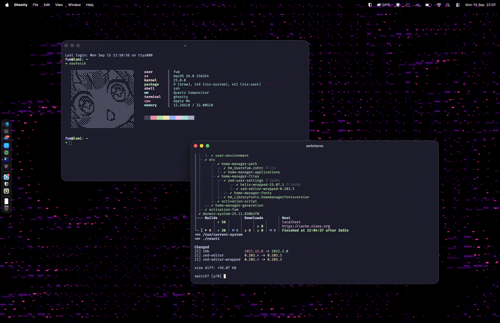
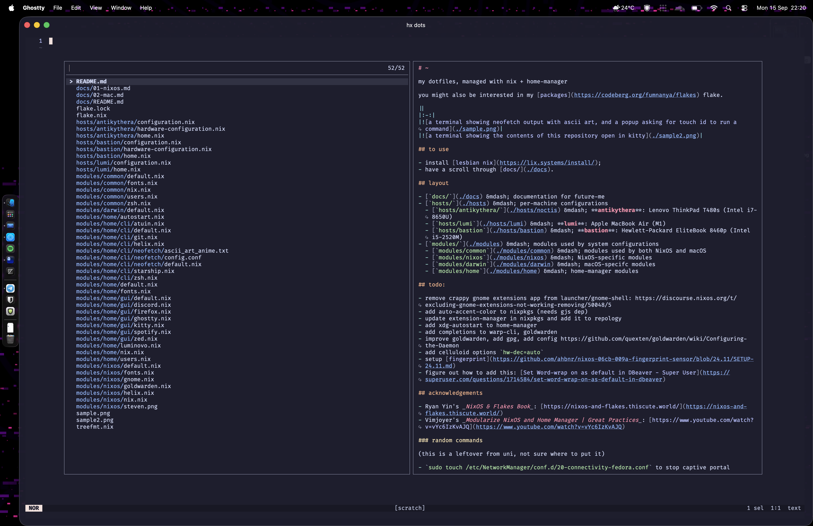

# ~

my dotfiles, managed with nix + home-manager

you might also be interested in my [packages](https://codeberg.org/fumnanya/flakes) flake.

||
|:-:|
||
||

## to use

- install [lesbian nix](https://lix.systems/install/);
- have a scroll through [`docs/`](./docs).

## layout

- [`docs/`](./docs) &mdash; documentation for future-me
- [`hosts/`](./hosts) &mdash; per-machine configurations
  - [`hosts/lumi`](./hosts/lumi) &mdash; **lumi** (work/personal computer) &mdash; Apple MacBook Air (M4)
  - [`hosts/bastion`](./hosts/bastion) &mdash; **bastion** (home &ldquo;server&rdquo;) &mdash; Hewlett-Packard EliteBook 8460p (i5-2520M)
  - [`hosts/antikythera/`](./hosts/antikythera) &mdash; **antikythera** (defunct personal computer) &mdash; Lenovo ThinkPad T480s (i7-8650U)
- [`modules/`](./modules) &mdash; modules used by system configurations
  - [`modules/common`](./modules/common) &mdash; modules used by both NixOS and macOS
  - [`modules/nixos`](./modules/nixos) &mdash; NixOS-specific modules
  - [`modules/darwin`](./modules/darwin) &mdash; macOS-specifc modules
  - [`modules/home`](./modules/home) &mdash; home-manager modules

## todo:

#### macOS
- figure out how to add this: [Set Word-wrap on as default in DBeaver - Super User](https://superuser.com/questions/1714584/set-word-wrap-on-as-default-in-dbeaver)

#### NixOS
- remove crappy gnome extensions app from launcher/gnome-shell: https://discourse.nixos.org/t/excluding-gnome-extensions-not-working-removing/50048/5
- add auto-accent-color to nixpkgs (needs gjs dep)
- update extension-manager in nixpkgs and add it to repology
- add xdg-autostart to home-manager
- add completions to warp-cli, goldwarden
- improve goldwarden, add gpg, add [config](https://github.com/quexten/goldwarden/wiki/Configuring-the-Daemon)
- add the celluloid `hw-dec=auto` option
- setup [fingerprint](https://github.com/ahbnr/nixos-06cb-009a-fingerprint-sensor/blob/24.11/SETUP-24.11.md) 
- add `sudo touch /etc/NetworkManager/conf.d/20-connectivity-fedora.conf` to some sort of home-manager module to stop captive portal helpers from popping up: [https://unix.stackexchange.com/a/423708](https://unix.stackexchange.com/a/423708)

## acknowledgements

- Ryan Yin's _NixOS & Flakes Book_: [https://nixos-and-flakes.thiscute.world/](https://nixos-and-flakes.thiscute.world/)
- Vimjoyer's _Modularize NixOS and Home Manager | Great Practices_: [https://www.youtube.com/watch?v=vYc6IzKvAJQ](https://www.youtube.com/watch?v=vYc6IzKvAJQ)
